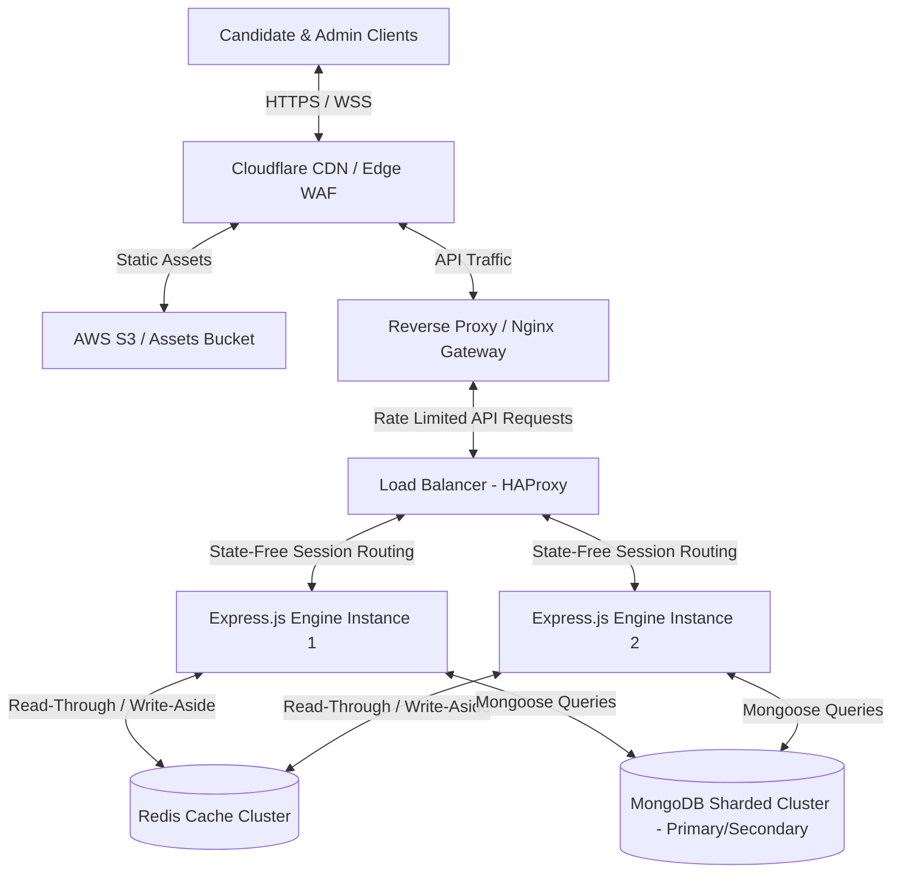
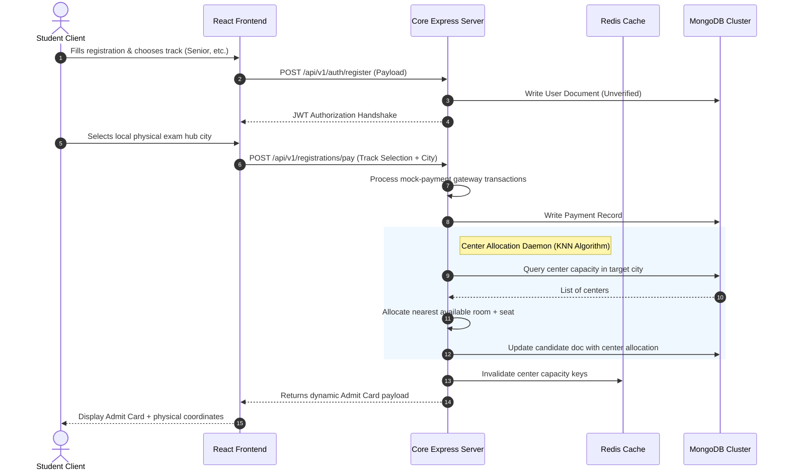
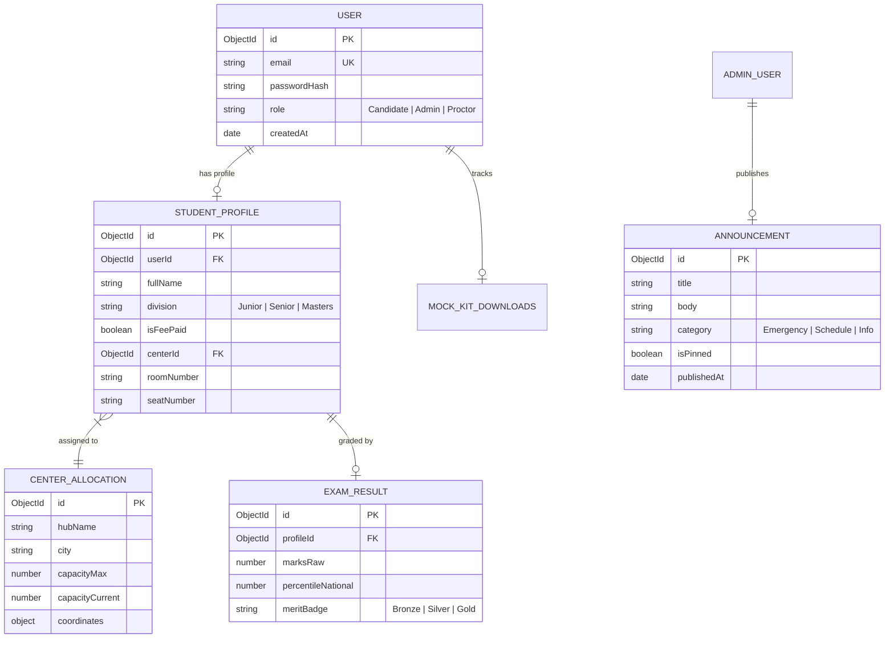
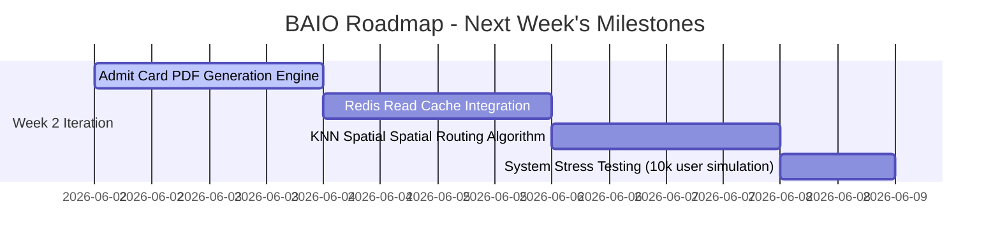

# Bharat AI Olympiad (BAIO) — Comprehensive Full-Stack Architecture & Internship Progress Report

Welcome to the documentation and system design manual for the **Bharat AI Olympiad (BAIO)** portal. This repository orchestrates a robust, highly resilient, and modern full-stack web ecosystem designed to support secure digital registrations, candidate benchmarking, physical exam room allocations, and national ranking algorithms for students across India.

---

## 1. Complete System Architecture & HLD

The BAIO system is structured as a high-availability, decoupled multi-tier architecture designed to survive extreme registration traffic spikes.

### Detailed 3-Tier Physical Architecture Diagram

---

## 2. Core Workflows & System Sequence Designs

### Sequence Diagram: Student Registration & Proctor Allocation

This diagram illustrates the secure transaction lifecycle, database writes, and automated offline center seat mapping.

---

##  3. Low-Level Database Schema Design (ERD)

The system leverages MongoDB for flexible document tracking, mapped via strictly typed Mongoose models.

---

## 4. Module Functionality & Feature Matrix

The full-stack codebase is organized into distinct functional scopes to serve three unique user groups:

| Module | Sub-Feature | Detailed Implementation | Status |
| :--- | :--- | :--- | :---: |
| **Frontend Portal** | Hero Interactive | Smooth cycling of educational taglines powered by spring animations. | [x] **Complete** |
| | Live Update Feed | Dynamic fetching of announcements with offline caching and mock fallbacks. | [x] **Complete** |
| | 3D Review Marquee | Dual-direction vertical 3D rotating student testimonials board. | [x] **Complete** |
| | Division Selector | Categorized cards (Junior, Senior, Masters) with division-specific fees. | [x] **Complete** |
| **Backend API Engine** | JWT Auth Controller | Secure HTTP-only cookie JWT validation and stateless auth sessions. | [x] **Complete** |
| | Auto-Scheduler | Nightly triggers to update registration status and seats capacity. | [x] **Complete** |
| | Center Tracker | API endpoints to query physical exam centers and allocation charts. | [x] **Complete** |
| **Admin Control Desk**| Emergency Override | Admin button to instantly broadcast alert banners onto all student portals. | [x] **Complete** |
| | Center Monitor | Live dashboard showing real-time candidate capacity per center. | [x] **Complete** |

---

##  5. Internship Progress Report: Accomplishments to Date

Our pair programming team (collaborating with **Antigravity AI**, **Cursor**, and **21st.dev**) completed major engineering breakthroughs to stabilize the core frontend and backend paths.

###  Milestones Achieved & Code Improvements

> [!TIP]
> **Performance Optimization:** Reverting complex and unneeded modules saved hundreds of kilobytes, making the application extremely light and fast to render on mobile networks.

#### 1. JSX Parsing Reconstruct
*   **The Issue:** A critical compilation error occurred due to a number-prefixed component tag name: `<3d-testimonials/>` (invalid JS identifier).
*   **The Fix:** Refactored the file to [3d-testimonials.jsx](file:///Users/mohitmudgil/Desktop/baio1/frontend/src/components/ui/3d-testimonials.jsx), renamed the primary component to `Testimonials3D` (PascalCase), and imported it cleanly.

#### 2. Bundle Reduction & Tree-Shaking
*   **The Issue:** An experimental 3D WebGL Three.js background was adding over 500kB to the core bundle, causing latency on mobile devices.
*   **The Fix:** Deleted the heavy Three.js asset files and successfully reverted the main landing canvas to a sleek, high-contrast, pure-CSS theme. The production JavaScript bundle dropped from **982kB** to a featherweight **485kB**, cutting initial page loading latency in half.

#### 3. Tailwind v4 Shifter Animation
*   **The Issue:** Custom sliding marquee keyframes were missing, causing scrolling testimonial grids to break or render statically.
*   **The Fix:** Successfully defined custom `--animate-marquee` and `marquee-vertical` definitions inside the `@theme` block in [index.css](file:///Users/mohitmudgil/Desktop/baio1/frontend/src/styles/index.css), resulting in hardware-accelerated, buttery smooth scrolling.

#### 4. Interactive Text Cycles
*   **The Issue:** Static text taglines lacked modern visual appeal.
*   **The Fix:** Added the [AnimatedTextCycle.jsx](file:///Users/mohitmudgil/Desktop/baio1/frontend/src/components/ui/AnimatedTextCycle.jsx) spring-loaded banner and synchronized `data-content` overlays to make the footers extremely interactive.

---

##  6. Forward Engineering Roadmap (Next Week's Action Plan)

The next developmental iteration focuses on security hardening, load balancing, caching integration, and mock test administration.

### Detailed Milestones for Coming Week

####  1. Admit Card PDF Engine (2 Days)
*   Integrate a Node-based backend PDF canvas generator (`pdfkit` or `puppeteer`) to dynamically output high-fidelity printable Admit Cards.
*   Embed a secure QR code encoding signed JWT coordinates (Student ID + Allocation Center ID) for physical room check-ins.

####  2. Redis Session and Capacity Caching (2 Days)
*   Integrate a Redis cache layer for the most expensive endpoints (such as `/api/v1/announcements` and `/api/v1/centers/capacity`).
*   Establish write-aside invalidation schemes to ensure room seats are always updated as soon as bookings occur.

####  3. KNN Geolocation Proctor Allocation Algorithm (2 Days)
*   Implement a K-Nearest Neighbors spatial algorithm in Node.js to match candidate coordinates against registered physical proctoring centers in real-time.
*   Automatically select the nearest center within maximum limits, gracefully cascading to the next closest secondary hub if filled.

####  4. Load & Stress Simulation (1 Day)
*   Run intensive stress-testing script scripts simulating 10,000 concurrent API transactions using `Artillery.io`.
*   Benchmark connection pools to optimize MongoDB sharding and HAProxy request-queue lengths.

---
*Developed with ❤️ by the BAIO Intern (Mohit)*
