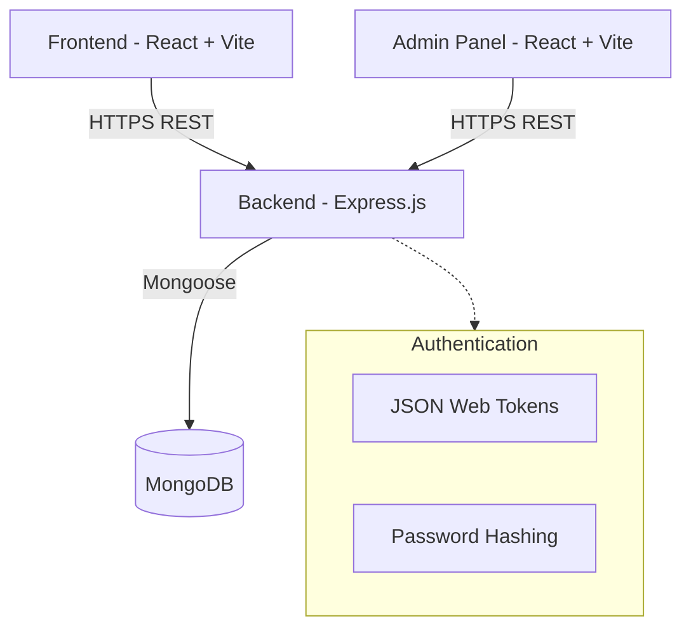

# Bharat AI Olympiad (BAIO) Platform

## Overview
The Bharat AI Olympiad (BAIO) is a comprehensive platform designed for students from classes 3 to 8, aligned with the CBSE CTAI curriculum. The system facilitates school registrations, student enrollments, result tracking, and Olympiad administration.

This repository contains the complete source code for the platform, divided into three distinct modules:
1. **Frontend**: The public-facing application for schools and students.
2. **Admin**: The internal dashboard for system administrators.
3. **Backend**: The centralized Node.js API server powering both the frontend and admin applications.

---

## System Architecture

The application follows a standard client-server architecture utilizing the MERN stack.



### Core Technologies
| Module | Technology Stack |
| :--- | :--- |
| **Frontend** | React, Vite, Tailwind CSS, Framer Motion, Context API |
| **Admin** | React, Vite, Tailwind CSS, Context API |
| **Backend** | Node.js, Express.js, JWT, Zod, Mongoose |
| **Database** | MongoDB Atlas |

---

## Directory Structure

The workspace is organized into a monorepo-style structure, isolating concerns while maintaining centralized management.

```text
baio1/
├── admin/                  # Admin dashboard application
│   ├── public/             # Static assets
│   ├── src/                # React source code
│   │   ├── components/     # UI components
│   │   ├── layouts/        # Layout wrappers
│   │   ├── pages/          # Application views
│   │   └── services/       # API interaction layer
│   └── vite.config.js      # Build configuration
│
├── frontend/               # Public frontend application
│   ├── public/             # Static assets
│   ├── src/                # React source code
│   │   ├── components/     # Reusable UI components
│   │   ├── context/        # Global state management
│   │   ├── pages/          # Application views
│   │   └── services/       # API interaction layer
│   └── vite.config.js      # Build configuration
│
└── backend/                # API server
    ├── src/
    │   ├── config/         # Environment variables & DB connection
    │   ├── controllers/    # Request handling logic
    │   ├── middlewares/    # Custom Express middlewares
    │   ├── models/         # Mongoose schemas
    │   ├── routes/         # API endpoint definitions
    │   ├── services/       # Business logic abstraction
    │   └── validators/     # Zod validation schemas
    └── package.json        # Dependencies and scripts
```

---

## Local Setup & Development

### 1. Prerequisites
- **Node.js** (v18.x or higher)
- **MongoDB** instance (Local or Atlas)
- **Git**

### 2. Environment Variables
Create `.env` files in the respective directories based on the `.env.example` templates.

**Backend (`backend/.env`)**
```env
PORT=5000
MONGODB_URI=your_mongodb_connection_string
JWT_SECRET=your_jwt_secret_key
NODE_ENV=development
```

**Frontend (`frontend/.env`)**
```env
VITE_API_URL=http://localhost:5000/api/v1
```

**Admin (`admin/.env`)**
```env
VITE_API_URL=http://localhost:5000/api/v1
```

### 3. Installation & Execution

Open three separate terminal windows to run the development servers concurrently.

**Terminal 1: Backend**
```bash
cd backend
npm install
npm run dev
```

**Terminal 2: Frontend**
```bash
cd frontend
npm install
npm run dev
```

**Terminal 3: Admin**
```bash
cd admin
npm install
npm run dev
```

---

## Core Modules & Workflows

### Authentication Flow
- The system employs Role-Based Access Control (RBAC).
- Supported roles: `student`, `school`, `admin`.
- Authentication is handled via JSON Web Tokens (JWT) transmitted over secure HTTP headers.

### Registration System
- **Schools**: Can register their institution and receive approval from administrators.
- **Students**: Can register individually or under their respective school codes.
- All registrations undergo rigorous validation using Zod schemas on the backend.

### Olympiad Management
- Administrators define Olympiad schedules, subjects, and eligibility criteria.
- Students can view available Olympiads and enroll based on their class level.

### Results & Reporting
- Administrators upload result datasets.
- Students and Schools can query diagnostic readiness reports and performance metrics via secure API endpoints.

---

## Code Quality & Standards

This project adheres to professional development standards:
- **Clean Code**: Minimal, descriptive commentary without informal language.
- **Modular Design**: Separation of concerns across controllers, services, and routes.
- **Validation First**: Strict input validation using Zod to prevent malformed data.
- **Error Handling**: Centralized error catching middleware in the backend.

---
*Maintained by the BAIO Development Team.*
