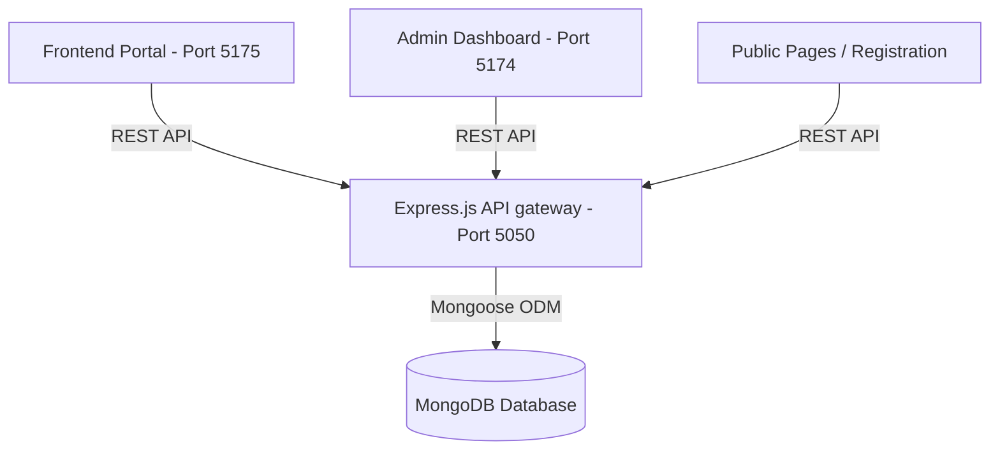

# BAIO 2026-27 Portal Technical Handoff Document

This documentation provides details on the software architecture, database models, local setup guidelines, parsing algorithms, and a summary of additions implemented for the Bharat AI Olympiad (BAIO) portal.

---

## 1. System Architecture Overview

The BAIO platform is structured as a mono-repository containing three independent modules connected to a unified Node.js API gateway.



### Components
1. **Frontend Portal (frontend/)**: React-based portal designed for schools and candidates. Powered by Vite, React Router, Framer Motion, and TailwindCSS styled using a unified custom aesthetic.
2. **Admin Dashboard (admin/)**: React-based central dashboard designed for BAIO central operations.
3. **Backend API Gateway (backend/)**: Express.js REST API server utilizing Mongoose ODM, JWT Authentication (dual admin/school tokens), and structured validation middleware (Zod).

---

## 2. Database Models & Schema Specifications

### School Schema (`School`)
Stores whitelisted institution records, coordinator details, and registration parameters:
* `name`: String (Required)
* `affiliationNumber`: String (Required, Unique)
* `board`: String (CBSE, ICSE, State, etc.)
* `principalName`: String
* `contactEmail`: String (Required, Unique)
* `contactPhone`: String
* `coordinator`: `{ name, email, phone }`
* `address`: `{ street, city, state, zip, country }`
* `isVerified`: Boolean (Default: false)
* `verificationRemarks`: String

### Participant Schema (`Student`)
Stores individual candidate records registered by verified schools:
* `name`: String (Required)
* `class`: String (Required, allowed: 6 to 12)
* `section`: String
* `rollNo`: String
* `gender`: String
* `division`: String (Junior for Grades 6-8, Senior for Grades 9-12)
* `schoolId`: ObjectId -> School (Required)

### Results Schema (`OlympiadResult`)
Stores candidate scores, percentile rankings, and status. Linked to school publishing rules:
* `participantId`: ObjectId -> Student (Required)
* `olympiadId`: ObjectId -> Olympiad (Required)
* `rollNumber`: String (Required, Unique)
* `scores`: `{ logicalReasoning, algorithmicThinking, aiCore, totalMarksObtained }`
* `totalMaxMarks`: Number (Default: 100)
* `percentage`: Number
* `percentile`: Number
* `rankings`: `{ national, state, school }`
* `qualificationStatus`: String (Participated, Qualified, MeritAwardee, NationalRanker)
* `isPublished`: Boolean (Default: true)

---

## 3. High-Accuracy Parser Algorithms

The uploader console parses Excel (`.xlsx`, `.xls`), CSV, and PDF tables using high-accuracy mapping libraries:

### Excel & CSV Parser (Spreadsheet Engine)
1. Integrates client-side parsing via the `xlsx` library.
2. Reads the file as an array buffer.
3. Extracts worksheet data and maps headers dynamically:
   - Matches headers using regex templates (e.g. `/name|student.*name/i` maps to `name`).
   - Normalizes class codes (e.g. `Class 7` or `Grade VII` extracts to string `"7"`).
4. Auto-assigns division: `Junior` if class is in 6, 7, 8; `Senior` for class 9, 10, 11, 12.

### PDF Extraction Engine (Structured Line Scanning)
1. Backend receives text-copyable PDFs via `multer`.
2. Utilizing line scanning logic, it splits PDF page feeds by newline markers (`\n`).
3. Extracts row lines by matching pattern matrices (e.g. names followed by numerical digits representing class/roll numbers).
4. Cleanses output, filters noise lines, maps fields, and responds with standard JSON batches.

---

## 4. Local Execution & Setup Commands

### Prerequisites
* **Node.js**: v18 or higher
* **MongoDB**: Active database instance

### Setup & Launch Commands
Execute these commands in separate terminal sessions:

```bash
# 1. Start Backend Gateway
cd backend
npm install
npm run dev # Runs on http://localhost:5050

# 2. Start Frontend School Portal
cd ../frontend
npm install
npm run dev # Runs on http://localhost:5175

# 3. Start Central Admin Dashboard
cd ../admin
npm install
npm run dev # Runs on http://localhost:5174
```

---

## 5. Internship Summary: Core Contributions & Accomplishments

During the developer internship, the following functional pipelines were successfully integrated:

1. **Multi-Level Dashboard Analytics & Metrics**:
   - Implemented school-wise, class-wise, section-wise, and student-level reports.
   - Built metrics overview cards displaying qualifiers, averages, total appeared, and total registered.
2. **Bulk Results Publishing Engine**:
   - Built a central control panel enabling admins to publish results school-wise or globally across all registered schools with one click.
   - Added automatic dashboard state synchronization when results are released or hidden.
3. **Advanced Excel Exporter**:
   - Replaced basic PDF scorecards with highly requested client-side Excel download modules.
   - Wired exporters for schools lists, class performance summaries, section breakdowns, and custom student selections (chunk exports).
4. **JSX Fixes & Quality Assurance**:
   - Debugged and resolved compilation errors inside frontend and admin components, ensuring clean builds across all project folders.

---

## 6. Seeded Test & Administrative Credentials

### Central Operations Admin Login
* **URL:** `http://localhost:5174/login`
* **Email:** `admin@baio.in`
* **Password:** `AdminPassword123!`

### School Portal Login (Delhi Public School, Rohtak)
* **URL:** `http://localhost:5175/school/login`
* **Contact Email:** `info@dpsrohtak.edu.in`
* **Affiliation Number:** `CBSE999999`
* **Coordinator Profile:** Vikram Singh (`coord@dpsrohtak.edu.in` / `9876543212`)

### Student Portal Login (Aditya Sharma)
* **URL:** `http://localhost:5175/student/login`
* **Email:** `aditya@dpsrohtak.edu.in`
* **Password:** `Password123!`
